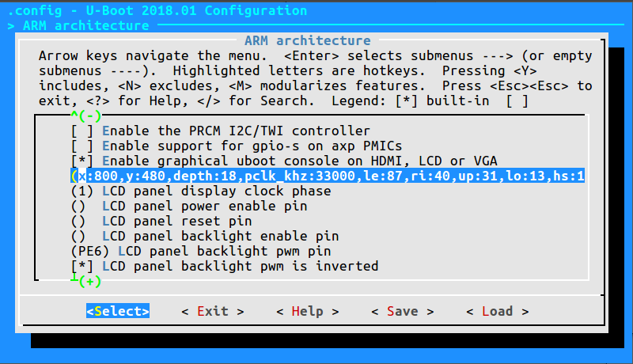
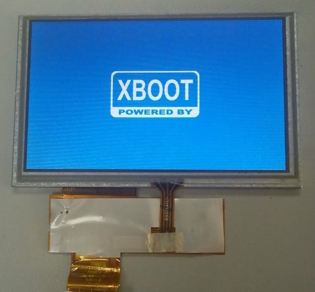

# 前言


此篇为少量或无需配置的开发，可帮助您快速上手，串口输出、点屏等操作确认 Nano 完好~
具体详细配置与解释说明，将在后文进行较为详细的介绍；如果您和笔者一样是个小白萌新，希望能给您的学习提供一点小小的tips；如果您已熟悉此流程，快速浏览即可 :)
笔者所用环境为：

> ubuntu 16.04 LTS 64位

对于本节内容，如有疑问，欢迎到 [Bootloader 与 RTOS 使用交流帖 ](http://bbs.lichee.pro/d/21-bootloader-rtos) 提问或分享经验。

## u-boot 初体验


### 安装交叉编译链

首先需要安装交叉编译链：


此处为获取7.2.1版本，您可获取其他版本或者通过链接直接下载
```
wget http://releases.linaro.org/components/toolchainbinaries/7.2-2017.11/arm-linux-gnueabi/gcc-linaro-7.21-2017.11-x86_64_arm-linux-gnueabi.tar.xz
tar -vxJf gcc-linaro-7.2.1-2017.11-x86_64_arm-linux-gnueabitar.xz
sudo cp -r ./gcc-linaro-7.2.1-201711-x86_64_arm-linux-gnueabi /opt/
sudo vim /etc/bash.bashrc
```
在文件末尾 添加以下内容
```
PATH="$PATH:/opt/gcc-linaro-7.2.1-2017.11-x86_64_arm-linux-gnueabi/bin"
```
添加完毕

使路径生效

    source /etc/bash.bashrc

此时可用 `arm-linux-gnueabi-gcc -v`进行测试；若普通用户状态下没有成功，通过 `sudo su`切换到root用户再尝试；

### 编译 u-boot

然后从github上拉取对 Nano 进行了适配的 u-boot：

``` 
sudo apt-get install git
git clone https://github.com/Lichee-Pi/u-boot.git
cd u-boot

# 查看分支
git branch -a
# 切换到 Nano 分支
git checkout nano-v2018.01
```

u-boot对于新手来说目录层级稍显复杂，您可参考下表进行快速的熟悉和目标文件定位

    .
    ├── api             //封装一些平台无关的操作，如字符串打印，显示，网络，内存
    ├── arch            //以平台架构区分
    │   ├──arm
    │   │   └──cpu
    │   │   │   └──arm926ejs
    │   │   │   │   └──sunxi   //cpu相关的一些操作，如定时器读取
    │   │   │   │   │   └──u-boot-spl.lds  //spl的放置方法
    │   │   └──dts  
    │   │   │   └──suniv-f1c100s-licheepi-nano.dts   // f1c100s芯片的一些配置
    │   │   │   └──suniv-f1c100s-licheepi-nano.dtb
    │   │   │   └──suniv-f1c100s.dtsi
    │   │   │   └──suniv.dtsi
    │   │   └──lib      //一些库文件
    │   │   └──mach-sunxi
    │   │   │   └──board.c          //board_init_f
    │   │   │   └──dram_sun4i.c     //ddr的操作，复位，时钟，延时，odt，etc.
    │   │   │   └──dram_helpers.c   //ddr的设置及读写测试
    ├── board
    │   ├──sunxi
    │   │   └──board.c              //sunxi_board_init 入口
    │   │   └──dram_suniv.c        //DRAM的一些默认参数
    ├── cmd             //Uboot命令行的一些命令
    ├── common          //含spl
    ├── configs         //menuconfig里的默认配置,比如各类驱动适配
    │   ├── licheepi_nano_defconfig
    │   ├── licheepi_nano_spiflash_defconfig
    ├── disk            //硬盘分区的驱动
    ├── doc
    ├── drivers         //外设驱动
    ├── dts             
    ├── examples
    ├── fs              //多种文件系统
    ├── include
    │   ├──configs
    │   │   └──sunxi_common.h   //预配置的参数，如串口号等
    │   │   └──suniv.h
    ├── lib             //加密压缩等算法
    ├── net             //nfs,tftp等网络协议
    ├── post
    ├── scripts

了解u-boot大致结构后，我们就可以开始尝试编译了；

```
# 此处告知make采用arm-linux-gnueabi下的所有交叉编译工具，目标架构为Arm，设定各项默认配置为 nano 的spiflash支持版
make ARCH=arm CROSS_COMPILE=arm-linux-gnueabi- licheepi_nano_spiflash_defconfig

# 若不带spi-flash的板子，请换成 licheepi_nano_defconfig

# 进行可视化配置
make ARCH=arm menuconfig
```

若要在套餐中附带的LCD上输出显示，请通过配置 ARM architecture --> Enable graphical uboot console on HDMI, LCD or VGA 为 **Y**
接着配置同级的 **LCD panel timing details** 为：
**x:800,y:480,depth:18,pclk\khz:33000,le:87,ri:40,up:31,lo:13,hs:1,vs:1,sync:3,vmode:0**

注：此块屏为为 800\*480 规格，如为 480\*272 请尝试如下配置:
**x:480,y:272,depth:18,pclk\khz:10000,le:42,ri:8,up:11,lo:4,hs:1,vs:1,sync:3,vmode:0**

并将 **LCD panel backlight pwm pin** 设为：
PE6 （查自 Nano 原理图）



```
# 开始编译
make ARCH=arm CROSS_COMPILE=arm-linux-gnueabi- -j8
```

编译完成后，可一看到目录下多了一堆以u-boot带头的文件，我们只需取
**u-boot-sunxi-with-spl.bin** 即可；

### 下载工具 sunxi-tools 安装

在食用前，我们仍需要一个适配 Nano 的下载工具;

```
git clone -b f1c100s-spiflash https://github.com/Icenowy/sunxi-tools.git
cd sunxi-tools
make && sudo make install
```

如果出现：`fel_lib.c:26:20: fatal error: libusb.h: No such file or directory`，那需要安装libusb：

```
sudo apt-get install libusb-1.0-0-dev
```

准备完软件，可以准备一下硬件:) 串口默认为 **UART0**

### 不插卡上电

新到的一片 Nano ，基本上是上电无反应的，LCD亮但无内容，此时 Nano 自动进入fel下载模式，可以通过命令 `sudo sunxi-fel ver` 来确认有无成功进入fel模式。

此时有两种方式进行程序下载：


1.以 uboot file-with-spl形式进行（单次运行，测试时个人推荐） 

    sunxi-fel uboot /your/path/to/u-boot-sunxi-with-spl.bin 

请自行修改到本机地址

2.烧进 spi-flash （开机自启）

    sunxi-fel -p spiflash-write 0 /your/path/to/u-boot-sunxi-with-spl.bin
> note: 重新烧录或重进fel模式时，请在上电时拉低SPI flash 的 CS引脚

下载结束后，即可看到串口输出信息，LCD显示图标与简单信息。

此时在串口控制台（minicom、putty或其他）输入 `bdinfo`

将列出各种板子信息，如：

    arch_number = 0x00000000                                                                                   
    boot_params = 0x80000100                                                                                   
    DRAM bank   = 0x00000000                                                                                   
    start    = 0x80000000                                                                                   
    size     = 0x02000000                                                                                   
    baudrate    = 115200 bps                                                                                   
    TLB addr    = 0x80FF0000                                                                                   
    relocaddr   = 0x80F72000                                                                                   
    reloc off   = 0xFF872000                                                                                   
    irq_sp      = 0x80E67D90                                                                                   
    sp start    = 0x80E67D80                                                                                   
    FB base     = 0x81E89000                                                                                   
    Early malloc usage: 118 / 400                                                                              
    fdt_blob = 80e67da8

愉快地完成了 u-boot 的初体验~

## Xboot 初体验

xboot秉持一次编写到处运行的理念，集成各类驱动支持，支持lua虚拟机，是一款优秀的bootloader；xboot无需额外配置直接上手！

> 请到 [xboot](https://github.com/xboot) 下载README中给出的官方交叉编译器；请下载5.3.1版本，其5.3.0版本貌似不支持软浮点配置命令。

```
git clone https://github.com/xboot/xboot.git
cd xboot
make CROSS_COMPILE=/path/to/arm-eabi- PLATFORM=arm32-f1c100s  #请自行修改到本机地址
```

烧写到RAM中并运行

``` 
sunxi-fel spl xboot.bin
sunxi-fel -p write 0x80000000 xboot.bin
sunxi-fel exec 0x80000000;
```

或烧写到SPI Flash

``` 
sunxi-fel -p spiflash-write 0 xboot.bin
```



```
    _                   _
 _  _ | |___ _____ _____ _| |_
\ \/ /|  _  |  _  |  _  |_   _|  (C) 2007-2018
 )  ( | |_| | |_| | |_| | | |____JIANJUN.JIANG__
/_/\_\|_____|_____|_____| |_____________________|

.
.
此处为各类驱动加载成功的信息，此处略去
.
.

xboot: /$
```
> 进入命令行后输入地址 /application/examples 将启动lua虚拟机运行Demo，可以算是xboot的酷炫小惊喜~

RTT 初体验
----------

荔枝派 Nano 也得到了优秀国产物联网操作系统 **RT-Thread** 的官方支持，有rtt相关知识或经验，我们就可以对 Nano 进行快速高效的开发；

首先我们来看 RT-Thread 的目录结构:

    .
    ├── bsp                         // 板级支持包
    │   ├── allwinner_tina          // 荔枝派 Nano 板级支持
    │   │   ├── applications        // 用户应用程序
    │   │   ├── drivers             // 各类驱动
    │   │   └── libcpu              // cpu相关的一些操作，如进出中断等
    │   │   └── rtconfig.py         // scons编译配置
    ├── components                  // 各类组件 包括C库、网络协议栈等
    ├── documentation               // 文档
    ├── examples                    // 各类示例
    ├── include                     // RTT库依赖
    ├── libcpu                      // 各类cpu架构的支持
    │   ├── arm                      
    │   │   ├── arm926              //  Nano 所属架构
    ├── src                         // 源码
    └── tools                       // RTT工具

此处我们进行 RTT固件 的编译尝试；

RTT官方已经给出由 [uestczyh222](mailto:lymz@foxmail.com) 所维护的 Nano固件[详细的编译、烧录过程](https://github.com/RT-Thread/rt-thread/blob/master/bsp/allwinner_tina/README.md)，搬运至此：

### 编译说明

| 环境         |说明 |
| ------------ |----- |
| PC操作系统   |Linux/MacOS |
| 编译器       |arm-none-eabi-gcc version 6.3.1 20170620 (release) |
| 构建工具    | scons |
 

1)  下载源码

``` 
git clone https://github.com/RT-Thread/rt-thread.git
```

2)  配置工程并准备env

``` 
cd rt-thread/bsp/allwinner_tina
scons --menuconfig
source ~/.env/env.sh
pkgs --upgrade
```

3  编译安装下载工具

``` 
pushd /tmp
git clone https://github.com/Icenowy/sunxi-tools.git
pushd sunxi-tools
git checkout -b f1c100s origin/f1c100s
make
sudo make install
popd
popd
```

4)  编译

    scons

如果编译正确无误，会产生rtthread.elf、rtthread.bin文件。其中rtthread.bin需要烧写到设备中进行运行。

### 烧写及执行

> **Note:**烧写工具目前仅支持Linux/MacOS环境,请在Linux/MaxOS环境下进行烧写操作

当正确编译产生出rtthread.bin映像文件后可以使用下面的方式来烧写到设备中。

#### 编译初始化引导文件
 编译依赖 arm-eabi-gcc
``` 
pushd ../../..
git clone https://github.com/uestczyh222/tina-spl.git
pushd tina-spl
make
cp output/f1c100s.bin ../rt-thread/bsp/tina/tina-spl.bin
popd
popd
```

#### 下载并运行
1. 短接flash 1、4脚(当flash中无可引导代码时无需此步骤)
2. 连接USB
3. 松开短接的引脚
4. 输入下列指令

```
sudo sunxi-fel -p write  0x00000000 tina-spl.bin
sudo sunxi-fel exec 0x00000000
sudo sunxi-fel -p write  0x80000000 rtthread.bin
sudo sunxi-fel exec 0x80000000
```

#### 运行结果

如果编译 & 烧写无误，会在串口0上看到RT-Thread的启动logo信息：

    \ | /
    - RT -     Thread Operating System
    / | \     3.0.2 build Feb  8 2018
    2006 - 2017 Copyright by rt-thread team
    periph_get_pll_clk:600000000
    cpu_get_clk:408000000
    ahb_get_clk:200000000
    apb_get_clk:100000000
    msh />

## 开箱常见问题&结语
> 问题待收集...

如您有任何疑问，或有想要荔枝派提供某个方面的教程，请在[Sipeed社区](bbs.sipeed.com) 留言；

荔枝派3000人QQ交流大群：488268051

荔枝派Telegram电报群：[Lichee Pi](https://t.me/sipeed)
