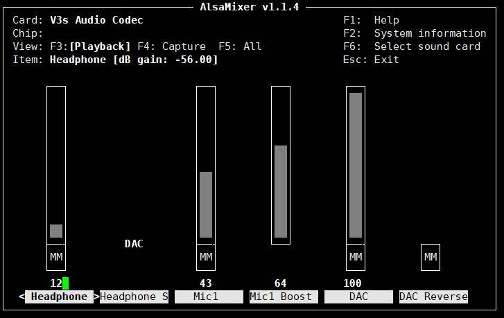

默认dts中使能了codec

需要使用的话，在buildroot中勾选 alsa-utils相关命令

## CODEC 设备


```
# ls /dev/snd
controlC0  pcmC0D0c   pcmC0D0p   timer
```

-   controlC0表示控制器
-   pcmC0D0c 表示capture
-   pcmC0D0p 表示play
-   timer 表示定时器

使用该设备编程可以参考：<http://blog.csdn.net/zhenwenxian/article/details/5901239>

出现了该设备说明codec驱动被正确加载。

## alsa-utils 使用

### 查看设备

    # arecord -l
    **** List of CAPTURE Hardware Devices ****
    card 0: Codec [V3s Audio Codec], device 0: CDC PCM Codec-0 []
    Subdevices: 1/1
    Subdevice #0: subdevice #0

### 调节音量


alsamixer是图形化的amixer工具,如下图所示




从左到右是：耳机音量，耳机输出源，Mic增益，mic1 boost, DAC增益。

可以很方便地调整音频输出设置

00表示当前音量正常，MM表示此声道是静音.可以通过键盘上的M键来切换静音和正常状态.

开机后默认状态是静音状态，需要取消掉静音状态

> `amixer -c 0 sset 'Headphone',0 100% unmute`

### 查看控制器 amixer contents


    numid=13,iface=MIXER,name='Headphone Source Playback Route'
    ; type=ENUMERATED,access=rw------,values=2,items=2
    ; Item #0 'DAC'
    ; Item #1 'Mixer'
    : values=0,0
    numid=3,iface=MIXER,name='Headphone Playback Switch'
    ; type=BOOLEAN,access=rw------,values=2
    : values=off,off
    numid=2,iface=MIXER,name='Headphone Playback Volume'
    ; type=INTEGER,access=rw---R--,values=1,min=0,max=63,step=0
    : values=7
    | dBscale-min=-63.00dB,step=1.00dB,mute=1
    numid=5,iface=MIXER,name='Mic1 Boost Volume'
    ; type=INTEGER,access=rw---R--,values=1,min=0,max=7,step=0
    : values=4
    | dBrange-
        rangemin=0,,rangemax=0
        | dBscale-min=0.00dB,step=0.00dB,mute=0
        rangemin=1,,rangemax=7
        | dBscale-min=24.00dB,step=3.00dB,mute=0

    numid=12,iface=MIXER,name='Mic1 Capture Switch'
    ; type=BOOLEAN,access=rw------,values=2
    : values=on,on
    numid=9,iface=MIXER,name='Mic1 Playback Switch'
    ; type=BOOLEAN,access=rw------,values=2
    : values=off,off
    numid=4,iface=MIXER,name='Mic1 Playback Volume'
    ; type=INTEGER,access=rw---R--,values=1,min=0,max=7,step=0
    : values=3
    | dBscale-min=-4.50dB,step=1.50dB,mute=0
    numid=6,iface=MIXER,name='ADC Gain Capture Volume'
    ; type=INTEGER,access=rw---R--,values=1,min=0,max=7,step=0
    : values=3
    | dBscale-min=-4.50dB,step=1.50dB,mute=0
    numid=7,iface=MIXER,name='DAC Playback Switch'
    ; type=BOOLEAN,access=rw------,values=2
    : values=off,off
    numid=1,iface=MIXER,name='DAC Playback Volume'
    ; type=INTEGER,access=rw---R--,values=1,min=0,max=63,step=0
    : values=63
    | dBscale-min=-73.08dB,step=1.16dB,mute=0
    numid=8,iface=MIXER,name='DAC Reversed Playback Switch'
    ; type=BOOLEAN,access=rw------,values=2
    : values=off,off
    numid=10,iface=MIXER,name='Mixer Capture Switch'
    ; type=BOOLEAN,access=rw------,values=2
    : values=off,off
    numid=11,iface=MIXER,name='Mixer Reversed Capture Switch'
    ; type=BOOLEAN,access=rw------,values=2
    : values=off,off

### 录音测试


耳机输入内置了放大器。

耳机，linein，同时只能使用1种。

使用输入端口前需要设置mixer控制器，ADC input Mux

ADC Input Mux 和对应的输入端口

    0   linein
    1   fmin
    2   mic1
    3   mic2
    4   mic1,mic2
    5   mic1+mic2
    6   output mixer
    7   linein,mic1

使用amixer来设置通道

    amixer -c <"card"> cset numid=<"control#"> <"input_port">

    where:
    <"card"> is the card, 0 for the sunxi-codec and 1 for the hdmi audio output
    <"input_port"> is the input port from the table
    <"control#"> is the control # showed using: aximer contents

使用下面命令使能耳机并录音

    amixer -c 0 cset numid=12 2     使能mic1
    arecord -D hw:0,0 -d 3 -f S16_LE -r 16000 tmp.wav   录音测试

### 播放

    amixer -c 0 sset 'Headphone',0 100% unmute
    speaker-test -twav -c2
    atest
    aplay  tmp.wav

配置文件

/etc/asound.conf(简易配置) :

    {{{
        pcm.!default{
            type hw
            card 0
            devive 0
            }  
        ctl.!default{
            type hw
            card 0
            device 0
            }  
    }}}

其中card代表声卡号, device代表设备号,asound.conf的配置极其强大和复杂,详情可查阅<http://www.alsa-project.org/main/index.php/Main_Page>

### card, device的确定方法


card, device必须对应hdmi的声卡号和设备号,可以使用aplay  -l查看对应的hdmi设备,可能会有出现多个hdmi设备,确定当前可以使用的hdmi设备的方法如下:

    #. cat /proc/asound/cards 查看nvidia设备对应的ID号(假设=1)
    #. alsamixer -c 1 打开声音设置,其中<S/PDIF>即为HDMI输出,“MM”代表静音,alsa在每次重启声音设备时都会默认为静音,所以必须首先打开音量再进行后续的操作。
    #. alsactl store 保存上述配置
    #. aplay -D hw:1,7  /usr/share/sounds/alsa/test.wav  "hw后的1代表声卡号,7代表设备号,需要根据aplay -l的输出来确定这两个数字"找到对应的hdmi输出口。

参考 <http://linux-sunxi.org/Audio_Codec>
