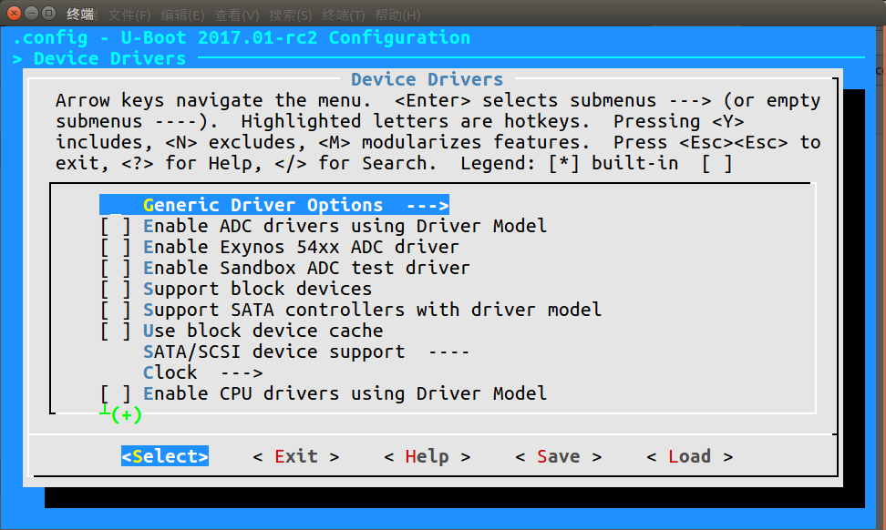
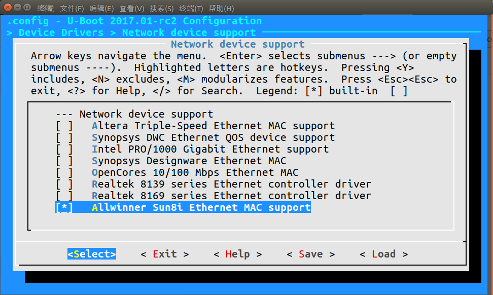
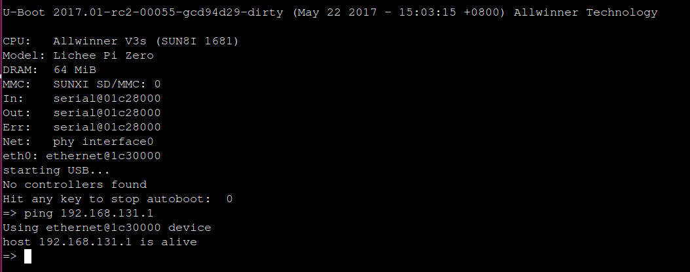

## U-Boot适配Ethernet


U-Boot
2017已经支持了sun8i-emac的驱动，只需要在编译时选上并且修改dts就行。

- 进入u-boot源码目录：

```
make LicheePi_Zero_defconfig
make menuconfig
```


-   选择 **Device Drivers ---\>**



-   选择 **Network device support ---\>** 并选中 **Allwinner Sun8i
    Ethernet MAC support**



-   修改dts

sun8i-v3s-licheepi-zero.dts：

    diff --git a/arch/arm/dts/sun8i-v3s-licheepi-zero.dts b/arch/arm/dts/sun8i-v3s-licheepi-zero.dts
    index 3d9168c..b8b9fc3 100644
    --- a/arch/arm/dts/sun8i-v3s-licheepi-zero.dts
    +++ b/arch/arm/dts/sun8i-v3s-licheepi-zero.dts
    @@ -49,6 +49,7 @@
            compatible = "licheepi,licheepi-zero", "allwinner,sun8i-v3s";

            aliases {
    +               ethernet0 = &emac;
                    serial0 = &uart0;
            };

    @@ -81,3 +82,14 @@
            usb0_id_det-gpio = <&pio 5 6 GPIO_ACTIVE_HIGH>;
            status = "okay";
    };
    +
    +&emac {
    +       phy = <&phy0>;
    +       phy-mode = "mii";
    +       allwinner,use-internal-phy;
    +       allwinner,leds-active-low;
    +       status = "okay";
    +       phy0: ethernet-phy@0 {
    +               reg = <1>;
    +       };
    +};

sun8i-v3s.dtsi：

    diff --git a/arch/arm/dts/sun8i-v3s.dtsi b/arch/arm/dts/sun8i-v3s.dtsi
    index ebefc0f..cb81dd5 100644
    --- a/arch/arm/dts/sun8i-v3s.dtsi
    +++ b/arch/arm/dts/sun8i-v3s.dtsi
    @@ -96,6 +96,11 @@
                    #size-cells = <1>;
                    ranges;

    +               syscon: syscon@01c00000 {
    +                       compatible = "allwinner,sun8i-h3-syscon","syscon";
    +                       reg = <0x01c00000 0x34>;
    +               };
    +
                    mmc0: mmc@01c0f000 {
                            compatible = "allwinner,sun7i-a20-mmc";
                            reg = <0x01c0f000 0x1000>;
    @@ -208,6 +213,17 @@
                            interrupt-controller;
                            #interrupt-cells = <3>;

    +                       emac_rgmii_pins: emac0@0 {
    +                               allwinner,pins = "PD0", "PD1", "PD2", "PD3",
    +                                               "PD4", "PD5", "PD7",
    +                                               "PD8", "PD9", "PD10",
    +                                               "PD12", "PD13", "PD15",
    +                                               "PD16", "PD17";
    +                               allwinner,function = "emac";
    +                               allwinner,drive = <SUN4I_PINCTRL_40_MA>;
    +                               allwinner,pull = <SUN4I_PINCTRL_NO_PULL>;
    +                       };
    +
                            uart0_pins_a: uart0@0 {
                                    pins = "PB8", "PB9";
                                    function = "uart0";
    @@ -270,6 +286,20 @@
                            status = "disabled";
                    };

    +               emac: ethernet@1c30000 {
    +                       compatible = "allwinner,sun8i-h3-emac";
    +                       reg = <0x01c30000 0x104>, <0x01c00030 0x4>;
    +                       reg-names = "emac", "syscon";
    +                       interrupts = <GIC_SPI 82 IRQ_TYPE_LEVEL_HIGH>;
    +                       resets = <&ccu RST_BUS_EMAC>, <&ccu RST_BUS_EPHY>;
    +                       reset-names = "ahb", "ephy";
    +                       clocks = <&ccu CLK_BUS_EMAC>, <&ccu CLK_BUS_EPHY>;
    +                       clock-names = "ahb", "ephy";
    +                       #address-cells = <1>;
    +                       #size-cells = <0>;
    +                       status = "disabled";
    +               };
    +
                    gic: interrupt-controller@01c81000 {
                            compatible = "arm,cortex-a7-gic", "arm,cortex-a15-gic";
                            reg = <0x01c81000 0x1000>,

- 编译：
```
make ARCH=arm CROSS_COMPILE=arm-linux-gnueabihf-
```

- 烧写：

```
dd if=u-boot-sunxi-with-spl.bin of=${card} bs=1024 seek=8
```

- 使用Ethernet：



如果出现： `*** ERROR:ipaddr' not set` ，就需要设置下自己的ip：
`setenv ipaddr 192.168.1.111`

## Kernel适配Ethernet


在最新的linux 4.14内核中，已经增加了对以太网的支持。

目前Linux
4.12还没又对sun8i-emac进行支持，所以Kernel要使用V3s的以太网要打sun8i-emac的补丁还有修改dts文件。

- 打上sun8i-emac补丁：

拉下我已经适配好的内核源码：<https://github.com/techping/linux/tree/licheepi-zero>

- 修改dts(上面git仓库是已经修改完的)：

sun8i-v3s-licheepi-zero.dts：

    index 387fc2a..904e60e 100644
    --- a/arch/arm/boot/dts/sun8i-v3s-licheepi-zero.dts
    +++ b/arch/arm/boot/dts/sun8i-v3s-licheepi-zero.dts
    @@ -50,6 +50,7 @@

            aliases {
                    serial0 = &uart0;
    +               ethernet0 = &emac;
            };

            chosen {
    @@ -101,3 +102,10 @@
            usb0_id_det-gpio = <&pio 5 6 GPIO_ACTIVE_HIGH>;
            status = "okay";
    };
    +
    +&emac {
    +       phy-handle = <&int_mii_phy>;
    +       phy-mode = "mii";
    +       allwinner,leds-active-low;
    +       status = "okay";
    +};

sun8i-v3s.dtsi：

    diff --git a/arch/arm/boot/dts/sun8i-v3s.dtsi b/arch/arm/boot/dts/sun8i-v3s.dtsi
    index 7107596..65be2ab 100644
    --- a/arch/arm/boot/dts/sun8i-v3s.dtsi
    +++ b/arch/arm/boot/dts/sun8i-v3s.dtsi
    @@ -40,7 +40,10 @@
    *     OTHER DEALINGS IN THE SOFTWARE.
    */

    +#include <dt-bindings/clock/sun8i-v3s-ccu.h>
    +#include <dt-bindings/reset/sun8i-v3s-ccu.h>
    #include <dt-bindings/interrupt-controller/arm-gic.h>
    +#include <dt-bindings/pinctrl/sun4i-a10.h>

    / {
            #address-cells = <1>;
    @@ -93,6 +96,12 @@
                    #size-cells = <1>;
                    ranges;

    +               syscon: syscon@1c00000 {
    +                       compatible = "allwinner,sun8i-h3-system-controller",
    +                               "syscon";
    +                       reg = <0x01c00000 0x1000>;
    +               };
    +
                    mmc0: mmc@01c0f000 {
                            compatible = "allwinner,sun7i-a20-mmc";
                            reg = <0x01c0f000 0x1000>;
    @@ -205,6 +214,17 @@
                            interrupt-controller;
                            #interrupt-cells = <3>;

    +                       emac_rgmii_pins: emac0@0 {
    +                               allwinner,pins = "PD0", "PD1", "PD2", "PD3",
    +                                               "PD4", "PD5", "PD7",
    +                                               "PD8", "PD9", "PD10",
    +                                               "PD12", "PD13", "PD15",
    +                                               "PD16", "PD17";
    +                               allwinner,function = "emac";
    +                               allwinner,drive = <SUN4I_PINCTRL_40_MA>;
    +                               allwinner,pull = <SUN4I_PINCTRL_NO_PULL>;
    +                       };
    +
                            i2c0_pins: i2c0 {
                                    pins = "PB6", "PB7";
                                    function = "i2c0";
    @@ -295,6 +315,31 @@
                            #size-cells = <0>;
                    };

    +               emac: ethernet@1c30000 {
    +                       compatible = "allwinner,sun8i-h3-emac";
    +                       syscon = <&syscon>;
    +                       reg = <0x01c30000 0x104>;
    +                       interrupts = <GIC_SPI 82 IRQ_TYPE_LEVEL_HIGH>;
    +                       interrupt-names = "macirq";
    +                       resets = <&ccu RST_BUS_EMAC>;
    +                       reset-names = "stmmaceth";
    +                       clocks = <&ccu CLK_BUS_EMAC>;
    +                       clock-names = "stmmaceth";
    +                       #address-cells = <1>;
    +                       #size-cells = <0>;
    +                       status = "disabled";
    +
    +                       mdio: mdio {
    +                               #address-cells = <1>;
    +                               #size-cells = <0>;
    +                               int_mii_phy: ethernet-phy@0 {
    +                                       compatible = "ethernet-phy-ieee802.3-c22";
    +                                       reg = <1>;
    +                                       clocks = <&ccu CLK_BUS_EPHY>;
    +                                       resets = <&ccu RST_BUS_EPHY>;
    +                               };
    +                       };
    +               };
                    gic: interrupt-controller@01c81000 {
                            compatible = "arm,cortex-a7-gic", "arm,cortex-a15-gic";
                            reg = <0x01c81000 0x1000>,

-   进入内核目录：

```
make sunxi_defconfig ARCH=arm
make menuconfig ARCH=arm
```

- 选择 Device Drivers ---\>
- 选择 Network device support ---\>
- 选择 Ethernet driver support ---\>
- 选择

        [*]   STMicroelectronics devices                                                         x x  
        <*>     STMicroelectronics 10/100/1000/EQOS Ethernet driver                       
        <*>       STMMAC Platform bus support                                                    x x  
        < >         Support for snps,dwc-qos-ethernet.txt DT binding.                            
        <*>         Generic driver for DWMAC                                                     x x  
        <*>         Allwinner GMAC support                                                       x x  
        <*>         Allwinner sun8i GMAC support

- 编译

`make ARCH=arm CROSS_COMPILE=arm-linux-gnueabihf-`

得到zImage和sun8i-v3s-licheepi-zero.dtb

- 烧写

将内核、dtb、rootfs刷入sd卡中，启动：

`ifup eth0`


eth0启动成功！


**Ethernet驱动适配成功！**
