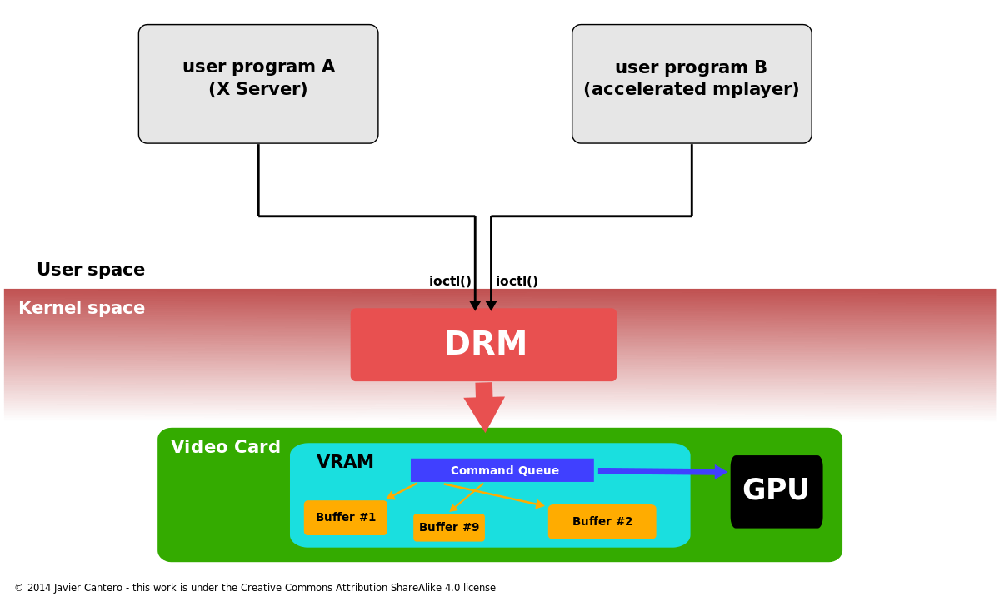

代码在driver/gpu/drm下

    The Direct Rendering Manager (DRM) is a subsystem of the Linux kernel responsible for  
    interfacing with GPUs of modern video cards. DRM exposes an API that user space programs  
    can use to send commands and data to the GPU, and perform operations such as configuring  
    the mode setting of the display. DRM was first developed as the kernel space component of  
    the X Server's Direct Rendering Infrastructure,[1] but since then it has been used by other  
    graphic stack alternatives such as Wayland. 

DRM（图形渲染架构）是linux的一个内核子系统，负责GPU的交互接口。

DRM暴露API，用户空间的程序可以发送命令和数据给GPU。

如果没有DRM：

使用DRM：

查看DRM驱动代码：

    root@bf756b445919:~/linux/drivers/gpu/drm/sun4i# ls *.c
    sun4i_backend.c  sun4i_dotclock.c  sun4i_framebuffer.c   sun4i_hdmi_enc.c       sun4i_layer.c  sun4i_tcon.c  sun6i_drc.c    sun8i_mixer.c
    sun4i_crtc.c     sun4i_drv.c       sun4i_hdmi_ddc_clk.c  sun4i_hdmi_tmds_clk.c  sun4i_rgb.c    sun4i_tv.c    sun8i_layer.c

参考现成的dts：

sun5i-a13-q8-tablet.dts

    #include "sun5i-a13.dtsi"
    #include "sun5i-reference-design-tablet.dtsi"

    / {
            model = "Q8 A13 Tablet";
            compatible = "allwinner,q8-a13", "allwinner,sun5i-a13";

            panel: panel {
                    compatible = "urt,umsh-8596md-t", "simple-panel";
                    #address-cells = <1>;
                    #size-cells = <0>;

                    port@0 {
                            reg = <0>;
                            /* TODO: lcd panel uses axp gpio0 as enable pin */
                            backlight = <&backlight>;
                            #address-cells = <1>;
                            #size-cells = <0>;

                            panel_input: endpoint@0 {
                                    reg = <0>;
                                    remote-endpoint = <&tcon0_out_lcd>;
                            };
                    };
            };
    };

    &be0 {
            status = "okay";
    };

    &tcon0 {
            pinctrl-names = "default";
            pinctrl-0 = <&lcd_rgb666_pins>;
            status = "okay";
    };

    &tcon0_out {
            tcon0_out_lcd: endpoint@0 {
                    reg = <0>;
                    remote-endpoint = <&panel_input>;
            };
    };

这里引用了 **compatible = "urt,umsh-8596md-t", "simple-panel"**;

在 **drivers/gpu/drm/panel/panel-simple.c**
里有很多屏幕型号，选取合适的屏幕型号即可

开启DRM还需要使能以下内核

1.  support for simple panels
2.  CMA
3.  DMA_CMA

然后需要失能（注释）掉原来的simplefb在dts中的节点
