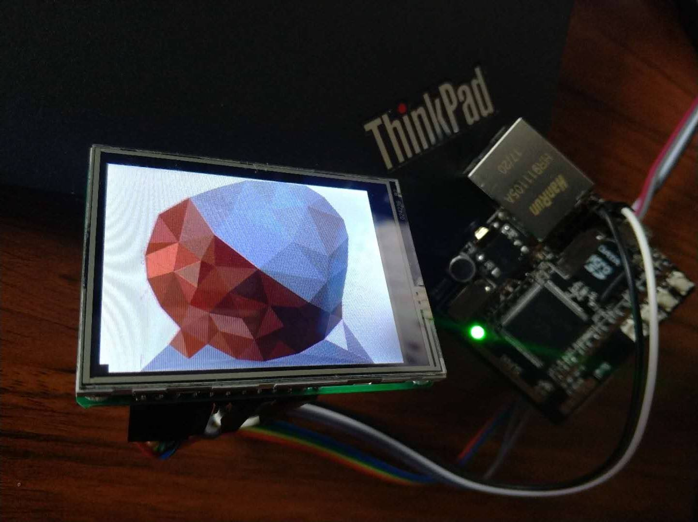

荔枝派配套的5寸LCD尺寸比较大，如果需要较小的屏幕，可以选择SPI屏。

目前最新的4.1x内核均包含了市面上常见的SPI液晶屏的驱动（fbtft），我们所要做的仅仅是在设备树中添加节点。

不过目前为止fbtft并未转正，依然存放在 *drivers/staging* 目录中。

## 配置内核添加fbtft驱动

使用make
menuconfig配置内核，加入ili9341驱动。fbtft还支持更多型号的SPI总线的液晶屏。关于支持列表这里就不一一列出，可以进入menuconfig中查看。

    Device Drivers --->
    [] Staging drivers --->
    <> Support for small TFT LCD display modules --->
    <> FB driver for the ILI9341 LCD Controller
    <> Generic FB driver for TFT LCD displays

## 修改设备树注册ili9341


设备树有包含和覆盖特性，所以我们可以在不修改默认配置文件的情况下，新增我们的板子的修改。

新建 **arch/arm/boot/dts/sun8i-v3s-licheepi-zero-spitft.dts**

里面加入如下内容，一个就是 **删除** 原来的simplefb节点（uboot里有使能fb的操作，必须删除而不是disable才行）

二就是增加ili9341 挂载在spi0上。这样fbtft驱动在加载的时候就会自动找到这个节点，挂载驱动，显示。

//这里spi速率使用了50M，超出9341的手册范围，但实际测试可以使用。

注意这里删除后，uboot仍然会初始化RGB的驱动，只是内核会使用spi显示。

如果需要完全去除RGB上的显示，需要在uboot里关闭显示。

    /dts-v1/;
    #include "sun8i-v3s-licheepi-zero.dts"

    /{
            chosen {
                    /delete-node/ framebuffer@0;
            };
    };

    &spi0 {
        status = "okay";

        ili9341@0 {
                compatible = "ilitek,ili9341";
                reg = <0>;

                spi-max-frequency = <50000000>;
                rotate = <270>;
                bgr;
                fps = <30>;
                buswidth = <8>;
                reset-gpios = <&pio 1 7 GPIO_ACTIVE_LOW>;
                dc-gpios = <&pio 1 5 GPIO_ACTIVE_LOW>;
                debug = <0>;
        };
    };

修改好保存后，在dtsMakefile里加入编译对象：\*sun8i-v3s-licheepi-zero-spitft.dtb\*

注：
- dc-gpios = \<&pio 1 5 GPIO\_ACTIVE\_LOW\>;
- 在设备树中，PA对应&pio 0, PB对应&pio 1，以此类推。因此dc-gpios实际表示的是PB5，也就是zero丝印上的PWM1。
- reset-gpios = \<&pio 1 7 GPIO\_ACTIVE\_LOW\>;
- 如果我的屏幕的RESET引脚连接了高电平，或者接了一个RC回路作为上电复位的信号，那么这里的复位引脚是不是可以不指定呢？
- 这样也是不可以的。因为在程序中，首先读取reset-gpios，若reset-gpios在设备树中不存在，那么直接忽略其余的信号。这样导致无法控制最关键的dc-gpios引脚。因此至少在不更改程序的前提下，这条信号是一定要写上的。

```
static int fbtft_request_gpios_dt(struct fbtft_par *par)
{
    int i;
    int ret;

    if (!par->info->device->of_node)
        return -EINVAL;

    ret = fbtft_request_one_gpio(par, "reset-gpios", 0, &par->gpio.reset);
    if (ret)
        return ret;
    ret = fbtft_request_one_gpio(par, "dc-gpios", 0, &par->gpio.dc);
    if (ret)
        return ret;
```

烧写运行后，可以在 **/sys/firmware/devicetree** 下查看实际的设备树

## 硬件连接
|SPI屏|zero|
| --- | --- |
|3v3  |3v3 |
|GND  |GND |
|DC   |PWM1|
|RST  |3v3 |
|CS   |CS  |
|CLK  |CLK |
|MISO |MISO|
|MOSI |MOSI|


## 上电启动


linux内核启动时会加载fbtft驱动，注册framebuffer设备，打印如下信息：

    [    1.131698] fbtft_of_value: buswidth = 8
    [    1.135680] fbtft_of_value: debug = 0
    [    1.139345] fbtft_of_value: rotate = 270
    [    1.143268] fbtft_of_value: fps = 30
    [    1.192746] mmc0: host does not support reading read-only switch, assuming write-enable
    [    1.202997] mmc0: new high speed SD card at address b368
    [    1.208984] mmcblk0: mmc0:b368 UD    968 MiB 
    [    1.214696]  mmcblk0: p1 p2
    [    1.439491] Console: switching to colour frame buffer device 40x30
    [    1.447560] graphics fb0: fb_ili9341 frame buffer, 320x240, 150 KiB video memory, 16 KiB buffer memory, fps=33, spi0.0 at 50 MHz

说明帧率在33帧左右，适合常见场合。

显示效果如下图：



使用mplayer播放视频效果如下, 还是很流畅的。

<http://v.youku.com/v_show/id_XMzM3NjY0NTU3Ng==.html>

系统占用如下：

    PID  PPID USER     STAT   VSZ %VSZ %CPU COMMAND
    105    98 root     T    19692  35%   0% mplayer dcp1.mp4
