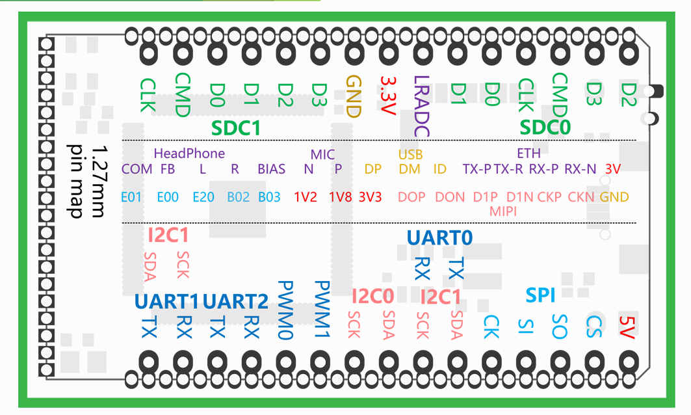

## LicheePi Zero 简介

荔枝派Zero（下面简称Zero）是一款精致迷你的 **Cortex-A7** 核心板/开发板，可用于初学者学习linux或者商用于产品开发。 Zero在稍长于SD卡的尺寸上（**45x26mm**）提供了丰富的外设（LCD,ETH,UART,SPI,I2C,PWM,SDIO---）和强劲的性能（**24M~1.2G, 64MB DDR** ）。

Zero的使用了精巧的PCB设计，使得开发和使用非常方便：

- 直插面包板
- 直插40P RGB LCD
- 使用OTG口进行供电和数据传输(虚拟串口，虚拟以太网等)
- 使用堆叠式的WiFi 模块联网
- 直接贴片

Zero提供了 **主线Linux** 支持 和
官方原生Camdriod（适用于行车记录仪应用）SDK，可在linux上使用任意你熟悉的语音编程。

## Zero上手提示

对于刚入坑的小白，请先看以下几点基础说明：

1.  Zero需要插卡启动（或者焊接spi flash），请不要问为什么插上usb没反应
2.  TF卡槽是下图中荔枝派logo上方的长方形插槽
3.  收到Zero后看到主芯片上有连锡请不要慌张，这是设计如此（相同的电源管脚），请参阅[原理图](https://dl.sipeed.com/shareURL/LICHEE/Zero/HDK)
4.  Zero的系统调试串口是UART0，即下图右下方的“U0T R”标识的两个引脚
5.  Zero正面的led不是上电就闪烁的，请不要认为上电后led不亮就是坏的
6.  Zero的usb是OTG usb，既可以供电，又能通信（比如作为usb虚拟网口[与电脑共享网络](http://bbs.ilichee.cc/t/tutorial-pc-share-network-to-zero-via-usb/55)）
7.  Zero usb口下方的“GND 5V”可以作为电源输入，使用串口小板的5V或者锂电池均可供电。
8.  推荐的两边排针焊接方式是向下焊接。“G 5V”插针推荐向上焊接。
9.  推荐的底层调试接法是：usb转串口小板接“U0T R”和“G 5V”。
10. 推荐的联网方式是：[usb虚拟网口](http://bbs.ilichee.cc/t/tutorial-pc-share-network-to-zero-via-usb/55)或者 [tf wifi](https://www.kancloud.cn/lichee/lpi0/327885)；或者使用淘宝店里的[usb转网口HUB](https://item.taobao.com/item.htm?id=538814529688) 。
11. Zero毕竟是上G主频的Cortex-A7处理器，运行时温度在40\~60℃，请不要认为芯片在此范围内的发热是短路。
12. Zero运行Linux空载电流约100mA，满载电流约150\~180mA，插上LCD电流约200\~300mA。不插卡上电电流约50\~60mA。

如果收到板子后还有其他疑问，请加 **官方交流QQ群：573832310** 。
入群验证答案是---请拿起板子看下上面芯片的丝印标识，谢谢。

## 设计框图

## Zero实物图

## 硬件资料

### 硬件参数

-   **CPU：** 全志V3S， ARM Cortex-A7, 最高1.2GHz
-   **内存：** 集成64MB DDR2
-   存储：
    -   预留SOP8 SPI Flash焊盘（可定制贴片8\~32MB SPI NorFlash,128MB Nand Flash）;
    -   板载 半槽TF卡座，可TF启动。

-   显示：
    -   通用 40P RGB LCD FPC座
    -   可直插常见的40P 4.3/5/7寸屏幕（板载背光驱动），通过转接板可插50P 7/9寸屏
    -   支持常见的272x480, 480x800,1024x600等分辨率
    -   板载电阻式触摸屏芯片，支持电阻屏
    -   板载RGB LED

-   通信接口
    -   SDIO x2，可搭配配套SDIO WiFi+BT 模块
    -   SPI x1
    -   I2C x2
    -   UART x3
    -   100M Ether x1（含EPHY）
    -   OTG USB x1
    -   MIPI CSI x1

-   其它接口
    -   PWM x2
    -   LRADC x1
    -   Speakerx2 + Mic x1

-   电气特性
    -   Micro USB 5V供电； 2.54mm 插针 3.3V\~5V供电； 1.27mm
        邮票孔供电
    -   输出 3.3V 和 3.0V（AVCC），可选择输入RTC电压
    -   1GHz linux空载运行电流 90\~100mA， 满载运行电流 \~180mA
    -   存储温度 -40\~125℃，运行温度 -20\~70℃

## 手册资料

国内下载链接：
网盘地址：[http://pan.baidu.com/s/1eR6uIsy](http://pan.baidu.com/s/1eR6uIsy)
芯片手册：[http://lichee.jicm.cn/doc/V3S/Allwinner_V3s_Datasheet_V1.0.pdf](http://lichee.jicm.cn/doc/V3S/Allwinner_V3s_Datasheet_V1.0.pdf)
原理图：[http://lichee.jicm.cn/doc/SCH_PCB/lichee_zero.pdf](http://lichee.jicm.cn/doc/SCH_PCB/lichee_zero.pdf)
封装库：[http://lichee.jicm.cn/doc/SCH_PCB/Zero.IntLib](http://lichee.jicm.cn/doc/SCH_PCB/Zero.IntLib)

## 管脚定义

> 图中UART0的TX RX画反了，以板子上的丝印为准。
