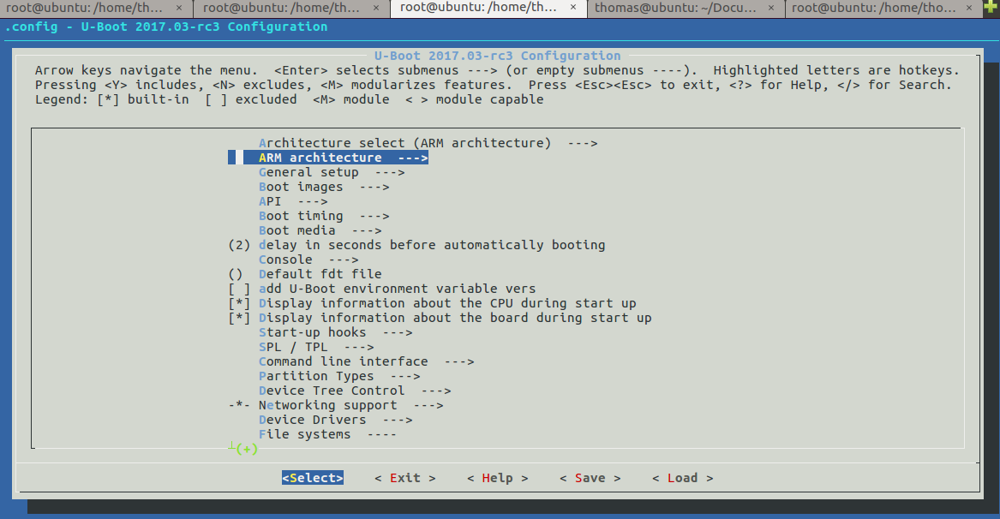
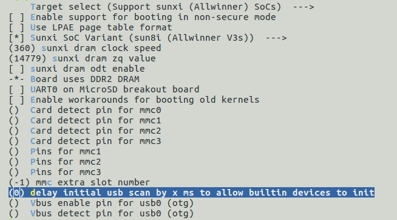

> 内容整理自： 贡献投稿篇 --> 投稿文章精选 --> Zero u-boot编译和使用指南

## Uboot配置命令


 `make ARCH=arm menuconfig`



---按回车，即选择当前菜单
------- 按Y 代表该config选项选中
------- 按N 代表不选中该选项
-------- 按M
代表该驱动编译成*.ko的方式，在系统起来之后，当驱动需要的时候加载
</>---------按/ 可以查找某个选项
---------退出
    < * > ----------按Y选中后的状态

**这里面有几个常见的配置选项我们可以看下：**

1.  第一个Architecture select架构选择，不用质疑这个是ARM架构
2.  第二个ARM architecture
    这个选项比较重要，主要配置ARM框架下的常用的配置函数以及LCD等参数




## DDR配置


```
···
Target select (Support sunxi (Allwinner) SoCs)   #进去之后可以选择sunxi Soc系列芯片
···
[*] Sunxi SoC Variant    # 这个就是对芯片Soc 的选择，我们可以看到配置选择了`sun8i (Allwinner V3s)
(360) sunxi dram clock speed     # 配置dram的时钟速率
(14779) sunxi dram zq value     #  配置dram的ZQ值，是用来动态加强DDR3的
-*- Board uses DDR2 DRAM     #   使用DDR2 DRAM
```

## LCD配置


```
[*] Enable graphical uboot console on HDMI, LCD or VGA   这个就是在显示设备上使能串口控制                                    
[ ] VGA via LCD controller support             使能支持VGA通过LCD的控制器，就是LCD和VAG转换需要的控制器       
(x:800,y:480,depth:18,pclk_khz:33000,le:87,ri:40,up:31,lo:13,hs:1,vs:1,sync:3,vmode:0) LCD pane
> 该选项就是配置LCD的分辨率的配置选项可以看到x是800 y是480 等等一些关于LCD的配置内容，点击回车进去可以对其进行修改。                          
(1)   LCD panel display clock phase               这个是LCD的显示时钟相位
()    LCD panel power enable pin               LCD的电源使能引脚
()    LCD panel reset pin                                             LCD的复位引脚          
(PB4) LCD panel backlight pwm pin                    背光PWN引脚 这个应该是调节亮度的引脚PB4
[*]   LCD panel backlight pwm is inverted            反转PWN背光引脚
[ ]   LCD panel needs to be configured via i2c                        
    LCD panel support (Generic parallel interface LCD panel)  --->     这个选择支持的LCDpanel
            (X) Generic parallel interface LCD panel                   这里选择支持通用的并行的LCD接口
            ( ) Generic lvds interface LCD panel                       这个是LVDS接口
            ( ) MIPI 4-lane, 513Mbps LCD panel via SSD2828 bridge chip 
            ( ) eDP 4-lane, 1.62G LCD panel via ANX9804 bridge chip    
            ( ) Hitachi tx18d42vm LCD panel                            
            ( ) tl059wv5c0 LCD panel         
(0) GMAC Transmit Clock Delay Chain        
```

## 时钟频率配置


`Boot images --->(1008000000) CPU clock frequency`

这里设置了CPU的时钟频率

## 开机延时设置

`delay in seconds before automatically booting`

这个是uboot开机的时候的一个等待时间的秒数，可以改大一点，默认是2s

## SPL配置


```
SPL / TPL ---> 这个就是SPL相关的配置了
[*]   MMC raw mode: by sector                       按扇区      
(0x50)  Address on the MMC to load U-Boot from  mmc加载uboot的地址
[*] Support GPIO                                 支持GPIO
[*] Support I2C                                 支持I2C
[*] Support common libraries                    支持通用lib
[*] Support disk paritions                      支持分区
[*] Support generic libraries                   支持一般lib库
[*] Support MMC                                 支持MMC
[*] Support power drivers                  支持电源驱动
[*] Support serial                               支持串口
```
