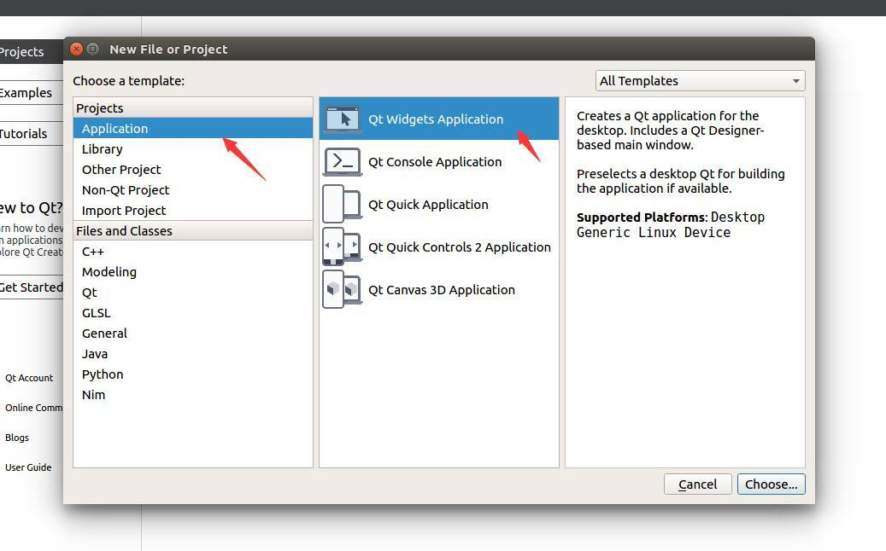
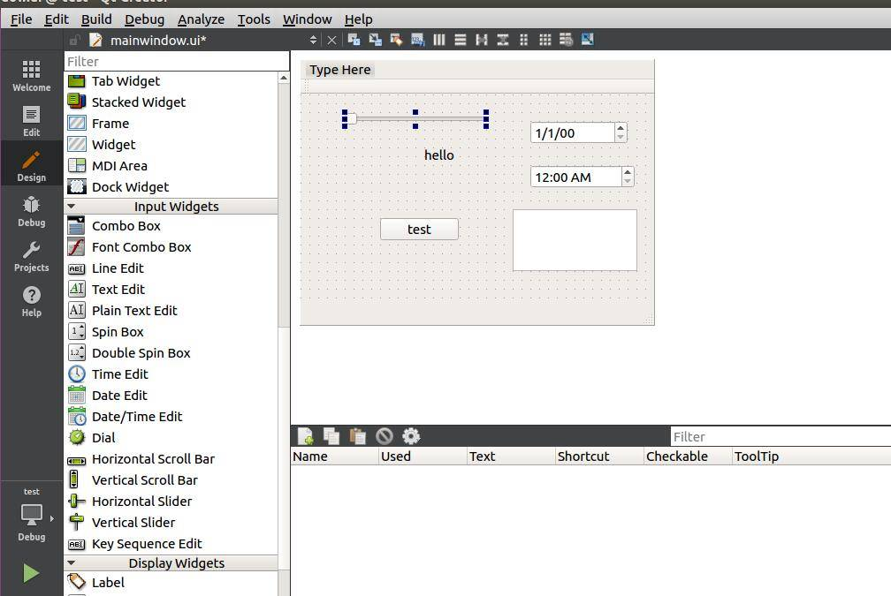
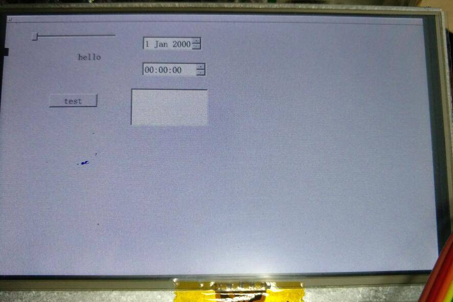

完成了tslib和QT的编译后，就成功搭建了Qt环境，接下来就可以使用QtCreator来开发图形界面了\~

## QtCreator安装


```
wget http://download.qt.io/official_releases/qtcreator/4.4/4.4.1/qt-creator-opensource-linux-x86_64-4.4.1.run
```

下载好后，在图形界面里双击运行即可。

注意，由于docker开图形界面比较麻烦，所以qtcreator不包含在docker镜像中，大家可以自行下载到本机安装。

## QtCreator配置


打开qtcreator，打开 Tools --> option --> Build&Run

首先配置Qt版本，这里需要用到前面编译好的qmake，点击add，把前面编译好的qmake指给它



然后配置工具链，把我们使用的linaro工具链指给它


最后配置 构建套件（Kit），就是组合Qt版本和工具链版本，我们这里新建 arm v7套件。


保存应用退出即可。

## QtCreator的简单使用


新建工程，一路默认下去（选择arm v7套件），完成。


随便拉些控件：



然后点左下角运行按键就会自动构建，在工程目录下生成对应二进制文件。

把生成的程序拷贝到目标板上，运行：

```
root@LicheePi:~# ./test 
./test: /usr/lib/arm-linux-gnueabihf/libstdc++.so.6: version `CXXABI_1.3.9' not found (required by ./test)
./test: /usr/lib/arm-linux-gnueabihf/libstdc++.so.6: version `CXXABI_1.3.9' not found (required by /opt/qt5.9.1-arm/lib/libQt5Widgets.so.5)
./test: /usr/lib/arm-linux-gnueabihf/libstdc++.so.6: version `CXXABI_1.3.9' not found (required by /opt/qt5.9.1-arm/lib/libQt5Gui.so.5)
./test: /usr/lib/arm-linux-gnueabihf/libstdc++.so.6: version `CXXABI_1.3.9' not found (required by /opt/qt5.9.1-arm/lib/libQt5Core.so.5)
```

检查现有的libstdc++:

```
root@LicheePi:~# strings /usr/lib/arm-linux-gnueabihf/libstdc++.so.6 | grep CXXA 
CXXABI_1.3
CXXABI_1.3.1
CXXABI_1.3.2
CXXABI_1.3.3
CXXABI_1.3.4
CXXABI_1.3.5
CXXABI_1.3.6
CXXABI_1.3.7
CXXABI_1.3.8
CXXABI_TM_1
CXXABI_ARM_1.3.3
```

说明系统里的libstdc++6使用了较老的编译器，导致test程序里链接后，无法正常使用库中的函数。

于是从linaro的 **arm-linux-gnueabihf/lib** 下拷出新的
**libstdc++.so.6.0.22** 覆盖即可。

再次运行，会发现界面上没有文字，终端提示没有字体。

于是下载任意字体，如simsun.ttf,放到 **/opt/qt5.9.1-arm/lib/fonts**
下，再重新运行，就有字体显示了。



此时会发现无法触摸，于是运行下触摸校准程序：

    ts_calibrate
    ts_test

校准，测试通过后，再次运行，即可触摸控制了。

但此时会看到终端光标在左下角闪烁，而且有时候内核信息会覆盖图像，所以：

禁止printk，隐藏光标。

```
echo 0 > /proc/sys/kernel/printk
echo -e "\033[?25l" > /dev/tty0
```
