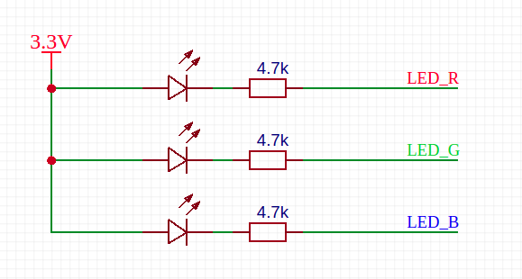

点灯程序作为学习所有开发板的第一个程序，就像学所有编程语言都是先学 hello world 一样，具有着神圣的意义

## 电路

众所周知， 点亮一个 LED 需要一个电源， 一个电阻， 一个 LED 灯泡，
在 Maix Dock 开发板上， 有三个 LED， 线路如下：




比如我们希望红灯点亮， 即 `LED_R` 连接的这个 LED， 图中可以看到 LED 的正极已经连接了 3.3V 电源， 所以我们只要让 LED_R 为低电平 LED 即可点亮。

> 注意， 这里 `LED_R` 是给这个引脚取的一个别名， 实际上是连接到芯片的一个引脚，比如 `Pin13`或者说`IO13`

## 外设到引脚的映射： FPIOA(现场可编程 IO 阵列， Field Programmable Input and Output Array)

可能你曾经用过一些单片机，在手册上都规定了引脚和片上外设功能（就是芯片内部集成的外设，比如 `GPIO`、`I2C`、`SPI` 等）的绑定，或者重映射。比如规定了 `I2C` 只能用 `Pin9` 和 `Pin10`，启动了重映射功能后，只能用`Pin11`和`Pin12`

但是 MaixPy 所使用的硬件 K210 的片上外设对应的引脚（硬件引脚）是可以**任意映射**的，相比之下 K210 硬件设计和软件设计的自由度更大。 比如 `I2C` 可以使用 `Pin11` 和 `Pin12`，也可以改成其它任意引脚
> 注意要区分 `GPIO` 和 `IO`的区别， `IO`也可以叫`Pin` 也就是引脚，是芯片引出来的硬件引脚， 而`GPIO`是一种外设，可以控制这些`Pin/IO` 的外设

因为有了这个强大的映射功能， 所以在使用引脚时，需要增加一步映射的步骤：
```python
from fpioa_manager import fm    # 导入库
fm.register(28, fm.fpioa.GPIO0)
```
这里我们将引脚 `28` 映射为了 `GPIO0` 的功能, 执行了这句命令后，引脚`28`和`GPIO0`就映射（绑定）好了，要取消映射（解绑），则需要调用`fm.unregister`函数，具体看`API`文档，这里不介绍

另外，`Pin` 和 外设只能**唯一**对应， 不能一对多，需要对同一个外设或者引脚重复映射，否则程序可能产生难以发现的错误（`BUG`）

## 代码

我们控制 LED 需要使用到 GPIO

> `board_info` 与板卡相关，不同板卡配置不同，使用前需要[手动配置](./api_reference/builtin_py/board_info.md)。

程序如下：

```python
from fpioa_manager import fm
from Maix import GPIO

io_led_red = 13
fm.register(io_led_red, fm.fpioa.GPIO0)

led_r=GPIO(GPIO.GPIO0, GPIO.OUT)
led_r.value(0)
```

按照前面运行代码的方法在终端里面运行代码， 会发现 LED 灯被点亮了！

接下来我们分析代码：

* 从 `fpioa_manager` 包导入`fm` 对象，主要用于引脚和外设的映射
* 从包 `Maix` 导入了 `GPIO` 这个类， GPIO 外设相关操作
* 定义一个变量`io_led_red`，值为`13`，即`Pin13/IO13`, 具体 LED 的引脚连接到了芯片的哪个引脚，请在前面的开发板介绍中看原理图
* 使用`fm`(fpioa manager 的缩写)这个内置的对象来注册芯片的外设和引脚的对应关系，　这里　`fm.fpioa.GPIO0` 是　K210 的一个 GPIO 外设（`注意区分 GPIO（外设） 和引脚（实实在在的硬件引脚）的区别` ）， 所以把 `fm.fpioa.GPIO0` 注册到了 引脚 `IO13`；

* 然后定义一个 `GPIO` 对象`led_r`， 具体参数看 `GPIO` API 文档， 在左边侧边栏查找。

* 使用 `led_r.value(1)` 或者 `led_r.value(0)` 来设置高低电平即可, 因为这里设置了低电平， 根据上面的原理图可知低电平导通，LED 灯亮


到这里已经可以点灯了， 现在可以自己尝试用 `for` 循环来实现 `LED` 闪烁或者流水灯～做出不同的变换效果

